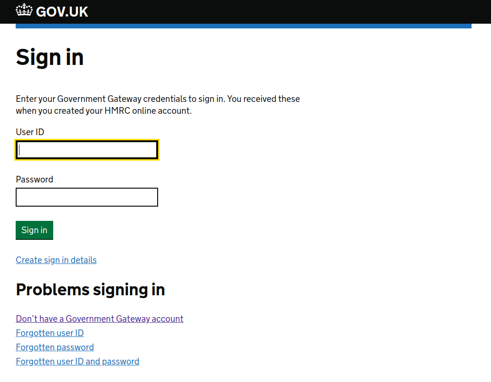
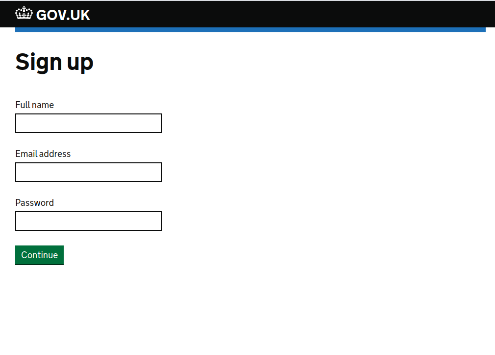
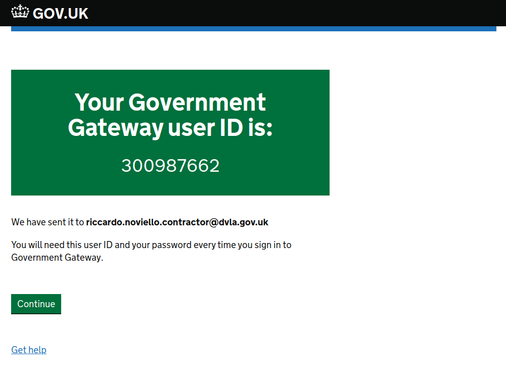

# Government Gateway Stub
A simple OpenID Connect identity provider with signup and login. Based on the NodeJS module oidc-provider.
The CODE returned from the provider mimics the CODE from Government Gateway, with the obvious exception of the signing key and issuer values.

This Stub has been developed by the PRS team at DVLA. We appreciate the code is not production quality, but it fulfil its purpose of stubbing the Government Gateway behaviour in line with the HMRC documentation from:https://gitlab.com/business-authentication-service/documentation/wikis/Authorisation


### Default User Accounts
For simplicity of testing we provide a user out of the box.

Government id: 123123123, password: "test"
Should return => "Bob Jones", "bob.jones@gmail.com"

## Usage
`docker-compose build`
`docker-compose up`

With the following configurable ENVIROMENT VARIABLES
```
      - PORT=9090
      - STUB_CLIENT_ID=stubOidcClient
      - STUB_CLIENT_SECRET=secretsarehardtokeep
      - AUTH_CALLBACK=http://localhost:3000/auth_callback
```


## Example


### 1 Redirect to OpenID Connect Server

```
GET http://localhost:9090/auth
?client_id=stubOidcClient
&redirect_uri=http://localhost:3000/auth_callback
&scope=openid
&response_type=code

```
REDIRECTS TO

```
http://localhost:3000/auth_callback?code=MDlkZTdmMGQtYzA4Mi00MzQ2LTgxM2YtMjMwZDRmMTYwMzVk6IaRX7sgrG49WMe1ZeEKSFS6tjUmN5t8AGJIwIBrIlAOulrbpQxSkO-JlNtjWxQ3FoZc2c_vo62NpWG355z5zg&session_state=9976abb20c79257f23a3b346ebd3168a7f227aaabe3bde2bebd906dfb5bff245.96be0038d3057052

```

### 2 Exchange Code from Token
```
POST https://localhost:9090/oauth/token
grant_type=authorization_code
&client_id=stubOidcClient
&client_secret=secretsarehardtokeep
&redirect_uri=http://localhost:3000/auth_callback
&code=MDlkZTdmMGQtYzA4Mi00MzQ2LTgxM2YtMjMwZDRmMTYwMzVk6IaRX7sgrG49WMe1ZeEKSFS6tjUmN5t8AGJIwIBrIlAOulrbpQxSkO-JlNtjWxQ3FoZc2c_vo62NpWG355z5zg&state=a08bbf629d35b5329880fd6ec24064115e18bf06&session_state=9976abb20c79257f23a3b346ebd3168a7f227aaabe3bde2bebd906dfb5bff245.96be0038d3057052
```


### 3 Verify User Token
Your “id_token” is:

eyJ0eXAiOiJKV1QiLCJhbGciOiJIUzI1NiJ9.eyJlbWFpbCI6InJpY2hhcmRAbm90YmluYXJ5LmNvLnVrIiwiZW1haWxfdmVyaWZpZWQiOnRydWUsIm5hbWUiOiJSaWNjYXJkbyBOb3ZpZWxsbyIsImdpdmVuX25hbWUiOiJSaWNjYXJkbyIsImZhbWlseV9uYW1lIjoiTm92aWVsbG8iLCJwaWN0dXJlIjoiaHR0cHM6Ly9saDUuZ29vZ2xldXNlcmNvbnRlbnQuY29tLy1jbTVncF9rbTZfay9BQUFBQUFBQUFBSS9BQUFBQUFBQUFBQS9BQ0hpM3JkTkYzVEVUUnZXYi0zZUVoT1h4VTRIYXp6MU9nL3Bob3RvLmpwZyIsImxvY2FsZSI6ImVuLUdCIiwiY2xpZW50SUQiOiJrYnl1RkRpZExMbTI4MExJd1ZGaWF6T3FqTzN0eThLSCIsInVwZGF0ZWRfYXQiOiIyMDE5LTA5LTI2VDEwOjM0OjQxLjMzMFoiLCJ1c2VyX2lkIjoiZ29vZ2xlLW9hdXRoMnwxMDEyMTM5MjA0NjQxNjAxOTYxNDkiLCJuaWNrbmFtZSI6InJpY2hhcmQiLCJpZGVudGl0aWVzIjpbeyJwcm92aWRlciI6Imdvb2dsZS1vYXV0aDIiLCJ1c2VyX2lkIjoiMTAxMjEzOTIwNDY0MTYwMTk2MTQ5IiwiY29ubmVjdGlvbiI6Imdvb2dsZS1vYXV0aDIiLCJpc1NvY2lhbCI6dHJ1ZX1dLCJjcmVhdGVkX2F0IjoiMjAxOS0wOS0yNlQxMDozNDo0MS4zMjlaIiwiaXNzIjoiaHR0cHM6Ly9zYW1wbGVzLmF1dGgwLmNvbS8iLCJzdWIiOiJnb29nbGUtb2F1dGgyfDEwMTIxMzkyMDQ2NDE2MDE5NjE0OSIsImF1ZCI6ImtieXVGRGlkTExtMjgwTEl3VkZpYXpPcWpPM3R5OEtIIiwiaWF0IjoxNTY5NDk0MDk5LCJleHAiOjE1Njk1MzAwOTl9.R97-VsdfW7ej3adpjd2Ytx--dVHYEAi6j5WlU2btS0c


## Screens
We have reproduce the same look and feel of Government Gateway, although we have simplified the Sign Up process, as the real flow is much more convoluted. We think testing the sign up flow does not add value in the end to end flow as it effectively means testing and out-of-the-box functionality provided to us.

### Homepage


### Sign Up


### Sign Up success
